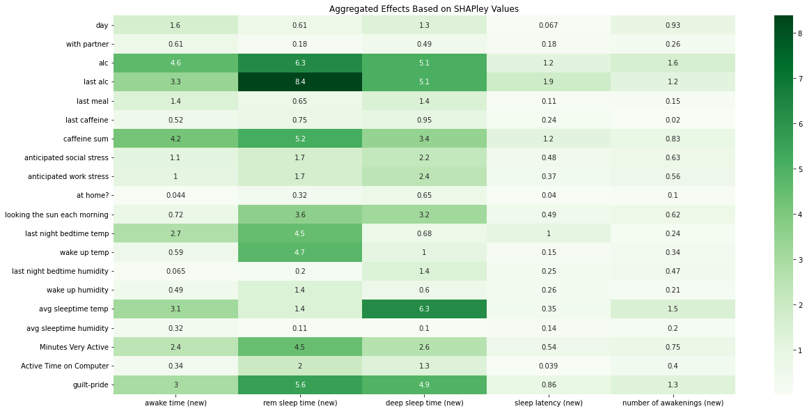
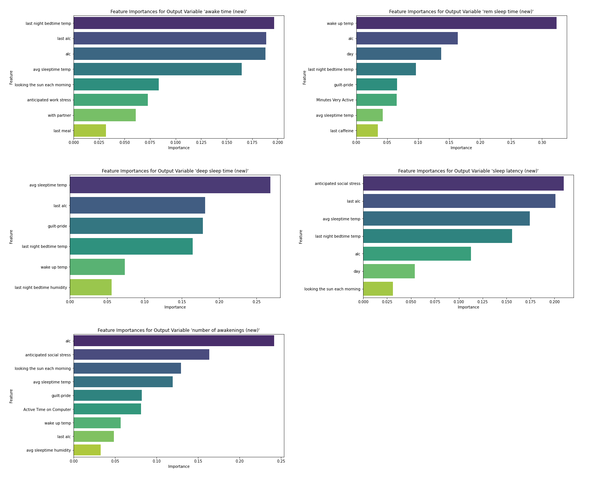

# sleepFactors

sleepFactors explores how daily behavior, environment, and stress signals relate to sleep quality. The project is built around a multitarget regression that compares several models, then uses explainability and sensitivity analysis to understand why the predictions move.

## What this project covers

- Predicting five sleep outcomes from daily lifestyle and environment features
- Comparing classical machine learning models with a neural tabular model
- Explaining predictions with SHAP, feature importance views, and dependence plots
- Stress-testing the learned relationships with perturbation-based sensitivity analysis

## Targets predicted

- Awake Time
- REM Sleep Time
- Deep Sleep Time
- Sleep Latency
- Number of Awakenings

## Predictor groups

The notebook combines 20 input variables across several categories:

- Lifestyle: alcohol intake, time of last alcohol intake, last meal, last caffeine, caffeine total
- Stress: anticipated social stress and anticipated work stress
- Environment: bedtime and wake-up temperature, bedtime and wake-up humidity, average sleep-time temperature and humidity
- Daily context: whether you were at home, with a partner, or got morning sunlight
- Activity and mood: minutes very active, computer time, and a guilt-pride score

## Workflow

1. Load the dataset from `sleep_raw.xlsx`.
2. Split the data into training and test sets.
3. Standardize the input features.
4. Train one model per target using linear-kernel SVR, XGBoost, and TabNet.
5. Compare model quality with RMSE and `R^2`.
6. Use SHAP and feature importance plots to inspect the strongest model family.
7. Run one-at-a-time and scaling sensitivity analysis to see how predictions respond when inputs are perturbed.

## Model comparison

| Target | SVR R2 | XGBoost R2 | TabNet R2 |
| --- | ---: | ---: | ---: |
| Awake time | 0.552 | 0.402 | 0.570 |
| REM sleep time | 0.542 | 0.464 | 0.572 |
| Deep sleep time | 0.545 | 0.472 | 0.600 |
| Sleep latency | 0.527 | 0.473 | 0.525 |
| Number of awakenings | 0.576 | 0.506 | 0.597 |

TabNet achieved the strongest score on four of the five targets. The linear SVR was slightly better on sleep latency, while default XGBoost trailed both alternatives across all targets in this notebook.

## Main findings

- `alc` showed up among the top three features across all five TabNet models.
- `last alc` repeatedly surfaced as a high-impact feature for four targets.
- `avg sleeptime temp`, `caffeine sum`, and `guilt-pride` also appeared often in the SHAP-based explanations.
- The aggregated SHAP heatmap makes the cross-target pattern clearer: `alc`, `last alc`, `guilt-pride`, `avg sleeptime temp`, and `caffeine sum` are the most recurring high-impact drivers across the five sleep outcomes.
- The directional SHAP views suggested that higher alcohol-related values were associated with more awake time and more awakenings, but lower REM and deep sleep estimates.
- The notebook goes beyond static rankings by checking both feature importance and the direction of each feature's contribution.

## Aggregated SHAP view

To complement the per-target SHAP plots, the notebook also combines mean absolute SHAP values into one heatmap across all five targets. This makes it easier to see which variables keep resurfacing instead of reading each target in isolation.

- `last alc` is especially strong for REM sleep time and remains important for deep sleep and awake time.
- `alc` and `caffeine sum` are consistent cross-target drivers, particularly for awake, REM, and deep sleep outcomes.
- `avg sleeptime temp` stands out most clearly for deep sleep time.
- Sleep latency has lower absolute SHAP magnitudes overall, which suggests a weaker or more diffuse feature signal than the other targets.

## Exploring the direction of the contributions

The notebook does not stop at ranking features by magnitude. It also uses SHAP beeswarm plots to show direction: points on the right increase the model output, points on the left decrease it, and the color scale shows whether high or low feature values are responsible.

Because there are five targets, a grid works better here than placing each plot separately.

### Observations from the directional SHAP plots

- **REM sleep time:** higher `last alc`, `anticipated social stress`, and `anticipated work stress` tend to push the prediction downward. Higher `Minutes Very Active` tends to push it upward.
- **Awake time:** higher `alc`, `caffeine sum`, and `last alc` tend to increase predicted awake time, while `looking the sun each morning`, `day`, and `Minutes Very Active` generally pull it down.
- **Deep sleep time:** higher `last alc`, `alc`, `caffeine sum`, `guilt-pride`, and `avg sleeptime temp` tend to reduce predicted deep sleep time.
- **Number of awakenings:** `alc`, `last alc`, `caffeine sum`, and `avg sleeptime temp` tend to raise the predicted number of awakenings.
- **Sleep latency:** higher `caffeine sum`, `last alc`, `last night bedtime temp`, and `guilt-pride` tend to increase predicted sleep latency.

These are model-based associations from the fitted TabNet explanations, so they are useful for interpretation but should not be read as causal claims.

## Sensitivity analysis highlights

The notebook includes two perturbation-based checks:

- One-at-a-time analysis, where a single feature is varied across its observed values while the others stay fixed
- Scaling analysis, where each feature distribution is widened by 1.5 times its standard deviation

One concrete example from the one-at-a-time analysis is the modeled effect of `alc`:

- `awake time (new)`: +5.27
- `rem sleep time (new)`: -6.81
- `deep sleep time (new)`: -5.93
- `sleep latency (new)`: +1.40
- `number of awakenings (new)`: +1.95

These values come from fitted surrogate lines inside the notebook and should be interpreted as model-based associations, not causal effects.

## Visual overview

## Repository contents

- `notebook (2).ipynb` - end-to-end analysis notebook
- `sleep_raw.xlsx` - source dataset used in the notebook
- `assets/flow_chart.svg` - workflow figure
- `assets/aggregated_effects_SHAPley.png` - aggregated SHAP heatmap across the five targets
- `assets/shap-direction-grid.png` - directional SHAP beeswarm grid across the five targets

## Important Notes

- This project is best read as an explainable modeling study rather than a causal sleep science claim.
- Some sensitivity steps intentionally simplify the problem by perturbing one feature at a time and not modeling every feature interaction.
