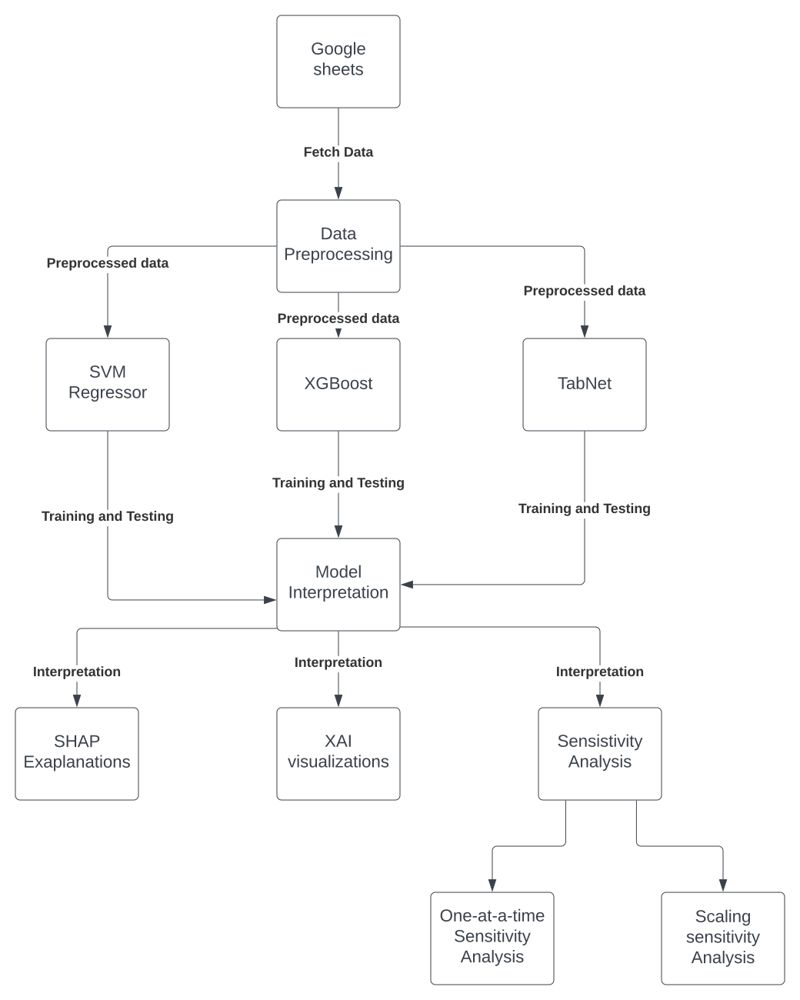

# Multivariate Regression and Explainable AI with SHAP

### 1. Features:  
#### Day & lifestyle context
`day` — Day of the week or day index in the dataset  
`with partner` — Whether you spent the day/evening with a partner  
`alc` — Alcohol consumed today (amount or yes/no)  
`last alc` — Time of last alcohol intake  
`last meal` — Time of last meal before sleep  
`last caffeine` — Time of last caffeine intake  
`caffeine sum` — Total caffeine consumed today  

#### Stress
##### Anticipated stress
`anticipated social stress`: Expected social‑related stress for the upcoming day  
`anticipated work stress`: Expected work‑related stress for the upcoming day  

#### Environment & habits
`at home?`: Whether you slept at home (vs. elsewhere)  
`looking the sun each morning`: Whether you viewed morning sunlight (morning light exposure)  

#### Sleep environment
`last night bedtime temp`: Bedroom temperature at bedtime  
`wake up temp`: Bedroom temperature at wake‑up  
`last night bedtime humidity`: Bedroom humidity at bedtime  
`wake up humidity`: Bedroom humidity at wake‑up  
`avg sleeptime temp`: Average bedroom temperature during sleep  
`avg sleeptime humidity`: Average bedroom humidity during sleep   

#### Activity metrics
`Minutes Very Active`: Minutes spent in high‑intensity physical activity  
`Active Time on Computer`: Total time spent actively using a computer  

#### Emotional metric
`guilt‑pride`: A self‑reported score capturing where you fall on the guilt - pride spectrum for the day (often used in behavioral datasets)  

#### Target variables
`Awake Time (new)`: total minutes spent awake during the sleep period, excluding the initial time it takes to fall asleep. This includes all wake episodes after sleep onset.   
`REM Sleep Time (new)`: total minutes spent in `Rapid Eye Movement (REM)` sleep. REM is associated with dreaming, emotional regulation, and memory consolidation.    
`Sleep Latency (new)`: the amount of time (in minutes) it takes to fall asleep after going to bed.  
`Number of Awakenings (new)`: the count of distinct wake episodes during the sleep period after initially falling asleep.  

### 2. Goals
This project focused on:  
i. Training regression models capable of predicting variables such as `awake time`, `rem sleep time`, `deep sleep time`, `sleep latency`, and `number of awakenings`. The models include: **Support Vector Machines (SVM)**, **XGboost**, and **TabNet Regressor**.     
ii. Providing explanations for the models' predictions by relying on: the models' intrinsic properties, an explainability tool i.e. SHAP, and traditional sensitivity analysis techniques. 

### 3. Observations
1. I found that using default model hyperparameters, the SVM regressor outperforms the XGBoost model on the basis of their Coefficients of Determination (r2_score). However, the TabNet model outperforms the SVM regressor. Subsequent analyses focused on understanding the TabNet models to find the most influential factors.

2. While many features have the potential to influence the models, `alc` stood out as one of the most influential in all the cases as it consistently appeared in the top three most important features based on the average `SHAP` values. Note that explanations provided by feature importance only gives a sense of the magnitude of a feature's contributions and does not provide clues as to the direction. For instance, `alc`, `last alc`, and `caffeine sum` are the most influential factors of `rem sleep time`, however, they are negatively correlated to `rem sleep time`. In order to provide better insights into the magnitude and direction of feature impacts, I made visualizations such as the Beeswarm plots (variable importance plot), and the partial dependence plots.

3. Lastly, I carried out sensitivity analysis to further investigate how the target variables repond to changes in the features. I explored two techniques: **One-at-a-time (OAP) sensistivity analysis** and **Scaling sensitivity analysis**. I found linear and non-linear relationships between some of the features and the target variables. For instance, the results show that a unit change in `alc` corresponds to a change in `awake time` by a factor of `5.2698` but a change in `rem sleep time` by a factor of `-6.8141`. More details can be found in the attached jupyter notebook. There were simplifying assumptions made regarding the features in the sensisitivity analysis. For instance, the effect of feature interactions was not accounted when perturbing one feature at a time. Execrcise some caution when drawing conclusions based on the results.

Note: The important relationships between our features and target show correlations but not causation. For all we know, there could be other confounding variables (besides the features considered in this project) responsible for the changes in the target variables. Hence, further experimentation and statistical tests are required inorder to make any conclusive claims.

## The flow chart of the entire process:

Please download the notebook to view if it is unable to render here.

